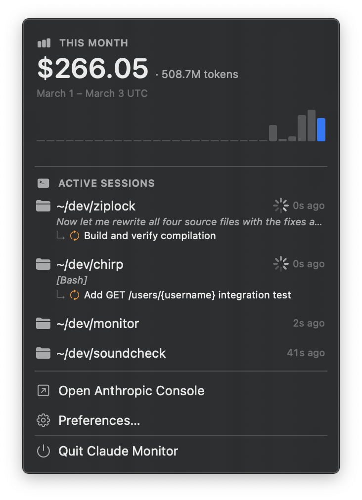

# ClaudeMonitor

A macOS menu bar app that monitors your [Claude Code](https://claude.ai/code) sessions in real time — cost, active sessions, task progress, and terminal focus.



## Features

- **Month-to-date cost** — calculated from local JSONL logs, no API key required
- **Active sessions** — detects running `claude` processes and matches them to their project directory
- **Spinner + status** — shows what Claude is working on while processing; clears immediately when it finishes (via Stop hook)
- **In-progress tasks** — reads `~/.claude/tasks/` and surfaces incomplete tasks under each session
- **Compaction indicator** — shows "Compacting…" when Claude Code is summarising the conversation context (via PreCompact hook)
- **iTerm2 focus** — brings the right iTerm2 tab to the front when Claude finishes a turn (requires iTerm2 Shell Integration)

All data is read locally. The app makes no network requests.

## Install

Download the latest `ClaudeMonitor.zip` from [Releases](https://github.com/thejefflarson/ClaudeMonitor/releases), unzip, and drag **ClaudeMonitor.app** to `/Applications`.

On first launch macOS may block it since it's not notarized. To allow it:

```bash
xattr -dr com.apple.quarantine /Applications/ClaudeMonitor.app
```

Then open it normally. The app installs its hooks into `~/.claude/settings.json` automatically on launch.

---

## Requirements

- macOS 13+
- [Claude Code](https://claude.ai/code) installed
- [xcodegen](https://github.com/yonaskolb/XcodeGen) (`brew install xcodegen`)
- Xcode 15+

## Building

```bash
xcodegen generate
xcodebuild -scheme ClaudeMonitor -configuration Release -derivedDataPath build
```

Then copy to Applications:

```bash
cp -R build/Build/Products/Release/ClaudeMonitor.app /Applications/
open /Applications/ClaudeMonitor.app
```

Or open `ClaudeMonitor.xcodeproj` in Xcode and run directly.

### Tests

```bash
xcodebuild test -scheme ClaudeMonitor -destination 'platform=macOS'
```

## Personalisation

The project uses `com.jeffl.es` as the bundle ID prefix. If you're building your own copy, update these before signing:

- **`project.yml`** — `bundleIdPrefix` and both `PRODUCT_BUNDLE_IDENTIFIER` values
- **`UnixSocketListener.swift`** — `socketPath` (`/tmp/com.jeffl.es.ClaudeMonitor.sock`)

The hook helper is installed to `~/.claude/monitor/notify` regardless of bundle ID.

## How it works

### Cost calculation

`LocalLogsService.monthlyUsage()` scans every JSONL file under `~/.claude/projects/` (and `~/.config/claude/projects/`) modified this calendar month, extracts `message.usage` from assistant messages, and applies per-model pricing:

| Model | Input | Output | Cache write | Cache read |
|---|---|---|---|---|
| Opus 4.x+ | $5 / MTok | $25 / MTok | $6.25 / MTok | $0.50 / MTok |
| Opus 3 (legacy) | $15 / MTok | $75 / MTok | $18.75 / MTok | $1.50 / MTok |
| Sonnet (default) | $3 / MTok | $15 / MTok | $3.75 / MTok | $0.30 / MTok |
| Haiku 3.5/4.x | $1 / MTok | $5 / MTok | $1.25 / MTok | $0.10 / MTok |

Costs are estimates; actual billing may differ.

### Session detection

Running `claude` processes are found via `proc_listallpids` + `proc_pidpath` (native kernel APIs, no `ps` subprocess). Each process's working directory is read via `proc_pidinfo(PROC_PIDVNODEPATHINFO)` and matched to the most recently modified JSONL in that project directory.

### Hooks

On first launch, the app installs two Claude Code hooks into `~/.claude/settings.json`:

- **Stop** — fires when Claude finishes a turn; clears the spinner immediately and optionally focuses iTerm2
- **PreCompact** — fires before context compaction; shows "Compacting…" in the menu

Both hooks call a small helper binary (`ClaudeMonitorHook`) bundled inside the app, which forwards the JSON payload to the app via a Unix domain socket.

## Architecture

```
ClaudeMonitor/
├── ClaudeMonitorApp.swift          # MenuBarExtra entry point + Settings scene
├── AppStore.swift                  # State; polls usage (5 min) and sessions (2 s)
├── Models/
│   ├── SessionInfo.swift           # One Claude Code session + tasks + state flags
│   ├── UsageData.swift             # Month-to-date cost + token totals
│   └── TaskItem.swift              # Single task (id, subject)
├── Services/
│   ├── LocalLogsService.swift      # All JSONL + task file reading
│   ├── HookInstaller.swift         # Auto-installs Stop + PreCompact hooks
│   ├── UnixSocketListener.swift    # Receives hook payloads over Unix socket
│   └── ITerm2FocusService.swift    # Focuses iTerm2 via AppleScript
└── Views/
    ├── MenuView.swift              # Popover UI
    └── PreferencesView.swift       # iTerm2 focus toggle

ClaudeMonitorHook/
└── main.swift                      # Hook helper: reads stdin, sends to socket
```

## Privacy

- Reads only `~/.claude/` and `~/.config/claude/` on your local machine
- No telemetry, no network requests, no accounts
- The hook helper binary communicates only with the local app via a Unix socket at `/tmp/`

## License

MIT
